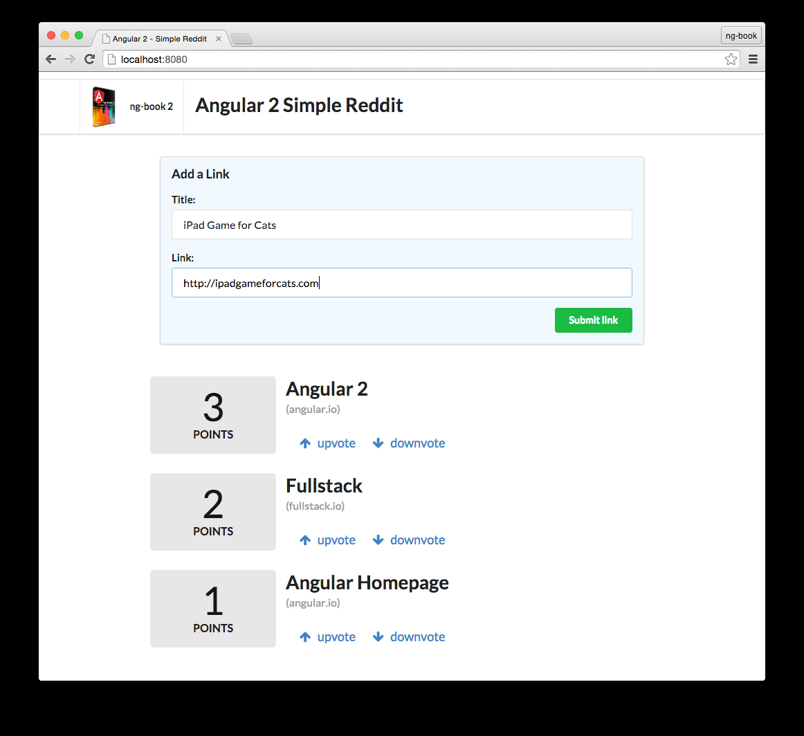

# Semplice copia di Reddit

In questo capitolo costruiremo un'applicazione che permetterà all'utente di pubblicare un articolo (con un titolo e una URL) ed esprimere dei voti.
Puoi pensare a quest'app come un inizio di un sito stile Reddit.
In questa semplice app copriremo concetti essenziali di Angular inclusi:

* Sviluppare componenti personalizzati
* Accettare input degli utenti da una form
* Mostrare liste di oggetti nella vista
* Intercettare clicks degli utenti e fare azioni su essi
* Fare il deploy su un server

Alla fine di questo capitolo saprai prendere una cartella vuota, costruirci dentro un'applicazione Angular e pubblicarla in produzione.
Avrai le basi per comprendere come sono costruite le applicazioni Angular e delle solide fondamenta per svilupparne una.

Come prima cosa l'utente pubblicherà un nuovo link dopodichè avrà la possibilità di dare un voto positivo o negativo ad ogni articolo. Ongi link avrà un punteggio e potremmo votare sui links che giudicheremo utili.

In questo progetto e per tutto il libro, useremo TypeScript. TypeScript è un superset di JavaScript ES6 a cui sono stati aggiunti i tipi. Parleremo di TypeScript in modo più approfondito nei prossimi capitoli.
Non preoccuparti se non ti senti confidente con la nuova sinstassi. Se sei familiare con ES5/ES6 dovresti essere capace di seguire senza problemi.
